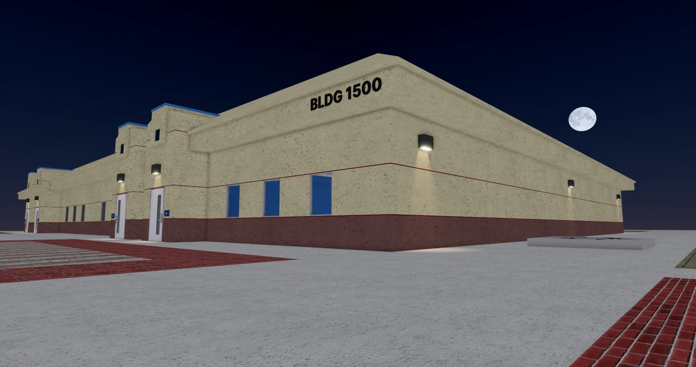

+++
title = ''
date = 2024-06-12T15:33:52-07:00
draft = false
+++

# Welcome to PV Creations

How does this work? Not a clue.

## About this site
This website is designed to be a reference for all things PV Creations. It's going to be quite detailed, containing tidbits about a lot of things that probably wouldn't fit elsewhere.

## Feedback
Questions? Comments? Want to report an issue with the site? Feel free to leave your feedback in the [PVC Discord server](https://discord.gg/kFckVRv56b). Some of you are way better at this than I am!

## Caveats

This site is, most importantly, a **work in progress**. If you're looking for anything polished, the best you'll get is a polished turd.


PV Creations is not run by someone with a wealth of web development experience. This site is largely created with a static site generator (Hugo) and a theme I found on its theme site. My overconfidence led me to a lot of frustration, which I think paid off – to a degree.

## Thanks
* [Luke Smith](https://www.youtube.com/watch?v=cvDyQUpaFf4), some guy who went on a long, unhinged tyrant about modern web bloat
* [Simple Icons](https://icon-sets.iconify.design/simple-icons/) for the Roblox and Ko-fi icons used